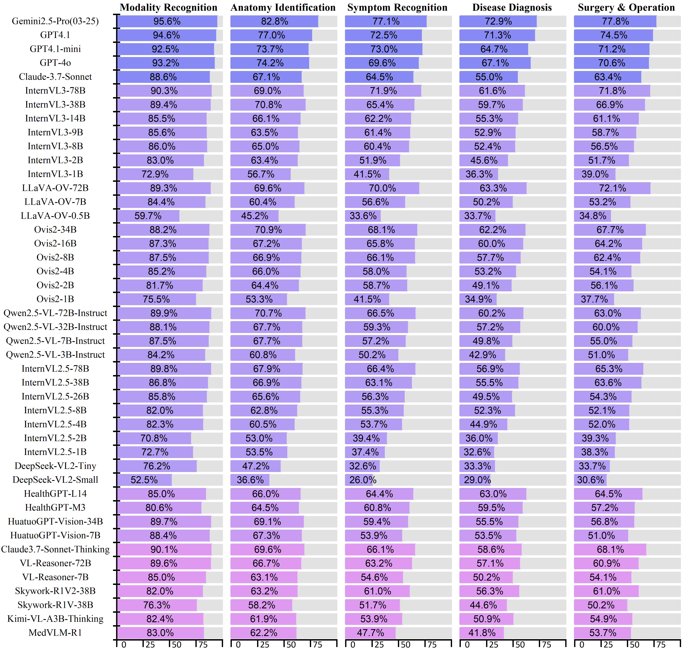

# MedBookVQA:  Systematic and Comprehensive Medical Benchmark Derived from Open-Access Book

## Introduction
The accelerating development of general medical artificial intelligence (GMAI), powered by multimodal large language models (MLLMs), presents transformative potential to tackle persistent healthcare challenges, including workforce shortages and rising costs. To evaluate these advancements effectively, the establishment of systematic benchmarks is essential.

Introducing **MedBookVQA**, a systematic and comprehensive multimodal benchmark derived from open-access medical textbooks. Our approach involves a standardized pipeline for the automated extraction of medical figures, aligned with relevant narratives. We generate 5,000 clinically relevant questions covering modality recognition, disease classification, anatomical identification, symptom diagnosis, and surgical procedures.

With a multi-tier annotation system categorizing queries across 42 imaging modalities, 125 anatomical structures, and 31 clinical specialties, MedBookVQA enables nuanced performance analysis in various medical subdomains. Our evaluation of diverse MLLMs uncovers significant performance disparities, emphasizing critical gaps in current GMAI systems and establishing textbook-derived benchmarks as vital tools for advancing clinical AI.

+ MedBookVQA Benchmark Results



## Usage
### Data
+ Download the data from [Hugging Face](https://huggingface.co/datasets/slyipae1/MedBookVQA/) to this folder, and unzip figures.zip. Organize files as follows:
    + evaluation
    + figures
    + data.json
        
    <details>
    <summary>Meta of data.json</summary>

    ```
    "_id": {
        "type": "string",
        "description": "Unique identifier for each entry."
        },
        "QAtype": {
        "type": "string",
        "enum": [
            "Modality Recognition",
            "Disease Classification",
            "Anatomy Identification",
            "Symptom Diagnosis",
            "Surgery & Operation"
        ],
        "description": "Type of the question asked."
        },
        "Question": {
        "type": "string",
        "description": "The question posed regarding the medical image."
        },
        "Answer": {
        "type": "string",
        "description": "The correct answer to the question."
        },
        "Distractors": {
        "type": "array",
        "items": {
            "type": "string"
        },
        "description": "List of distractor answers."
        },
        "correct_choice": {
        "type": "string",
        "description": "The correct answer choice (e.g., 'C'), corresponds to Answer."
        },
        "other_choices": {
        "type": "array",
        "items": {
            "type": "string"
        },
        "description": "List of other answer choices, corresponds to Distractors."
        },
        "image_path": {
        "type": "string",
        "description": "Path to the associated medical image."
        },
        "LABEL": {
        "type": "dict",
        "properties": {
            "Modality": {
            "type": "array",
            "items": {
                "type": "string"
            },
            "description": "Hierarchical labels for modality (ModalityCategory, Modality)."
            },
            "Anatomy": {
            "type": "array",
            "items": {
                "type": "string"
            },
            "description": "Hierarchical labels for anatomy (System, SubSystem, BodyPart, Organ)."
            },
            "Department": {
            "type": "array",
            "items": {
                "type": "string"
            },
            "description": "Hierarchical labels for department (DepartmentCategory, Department)."
            }
        }
        }
    ```

    </details>


## Evaluation
+ Change the image paths using "evaluation/change_path.py" if needed.
+ Run "evaluation/eval.py"
+ Use "evaluation/summerize_result.ipynb" for analysis